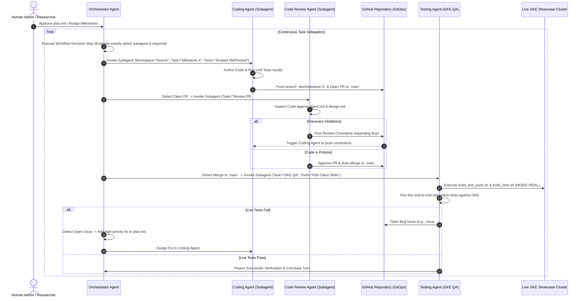

# Agent Operational Rules & Guidelines: GKE Feature Showcase Hub

This document defines mandatory operational rules, security policies, and quality standards for any AI agent or subagent executing development milestones on the GKE Feature Showcase Hub repository.

---

## Rule 1: Mandatory Test-Driven Execution & Verification
Every development milestone or feature task **MUST** conclude with robust automated verification before being marked as complete.

### Operational Requirements
1. **Comprehensive Test Mandate**: For every milestone or architectural feature, agents **MUST** author both isolated unit tests (`/tests/unit`) and live GKE integration tests (`/tests/integration`) designed to execute against active cloud infrastructure when `MODE=REAL`.
2. **Coverage Requirement**: Tests must cover both positive success paths and negative error/rejection handling (e.g., basic auth failures, JWT expiration, k8s exceptions, invalid namespaces).
3. **Execution Verification**: Before marking any task or milestone as `[x]` in `plan.md`, the agent **MUST** execute the entire pytest suite inside the virtual environment:
   ```bash
   .venv/bin/pytest tests/
   ```
4. **Zero Tolerance**: The test suite must pass with 100% success (zero failures or errors) before the agent concludes its turn.

---

## Rule 2: Mandatory Documentation & Specification Synchronization
Before concluding any milestone or marking it as complete (`[x]`), the executing agent **MUST** ensure all primary project documentation is perfectly synchronized with the codebase:

1. **`README.md`**: Must be updated with any new setup instructions, environment variables, CLI flags, or architectural descriptions introduced during the milestone.
2. **`design.md`**: Must be updated if any conceptual topology, database schema, or component interactions evolved.
3. **`plan.md`**: Must be updated to reflect granular task progress, marking active tasks as `[/]` and completed, pytest-verified tasks as `[x]`.

---

## Rule 3: Infrastructure-as-Code (IaC) & Reproducibility Mandate
To guarantee that the application remains 100% reproducible across any GCP environment:

1. **Prohibition of Direct `gcloud` CLI Execution**: Agents must **NEVER** alter GKE cluster configurations, node pools, IAM bindings, or cloud infrastructure by running manual or one-off `gcloud` terminal commands.
2. **Centralized Scripting**: All infrastructure modifications, permissions, or registry configurations must be explicitly authored inside the master infrastructure scripts:
   *   `build_infra.sh`: Master GKE cluster bootstrap and base resource provisioning.
   *   `scripts/build_and_push.sh`: Multi-stage container compilation and Artifact Registry deployment.
3. **Reproducible Execution**: Whenever infrastructure modifications are required, agents must update these master scripts and execute them directly to ensure complete reproducibility.

---

## Rule 4: Interactive User Communication & Design Inquiry
When interacting with human administrators or researchers during planning and design phases:

1. **Active Design Inquiry**: Agents are strongly encouraged to ask clarifying design and architectural questions when requirements are ambiguous or underspecified.
2. **Single Question Mandate**: Agents **MUST** always ask exactly **one question at a time**. Bundling multiple questions into a single prompt is strictly prohibited to ensure clean, focused decision-making.

---

## Rule 5: Strict Code Formatting & Type Hinting
1. **Type Annotations**: All new Python functions, methods, and variables **MUST** include explicit type hints (e.g., `def get_feature_status(name: str) -> dict:`).
2. **Pristine Formatting**: Agents must ensure all code adheres to PEP8 formatting guidelines (verifiable via `ruff` or `black`). Unused imports, unformatted lines, or dangling variables are strictly prohibited.

---

## Rule 6: Robust Error Handling & Structured Logging
1. **Prohibition of Silent Failures**: Bare `except:` blocks or silent `except Exception: pass` statements are strictly prohibited. 
2. **Contextual Logging**: All exceptions must be captured and logged with rich context using `logger.error(..., exc_info=True)` or `logger.warning()`.
3. **Structured HTTP Exceptions**: FastAPI REST controllers must return explicit, descriptive `HTTPException` models with appropriate HTTP status codes (400, 401, 403, 404, 500) rather than allowing internal exceptions to bubble up as generic 500 errors.

---

## Rule 7: Strict Security & Plaintext Secret Prohibition
1. **Zero Plaintext Credentials**: Agents must **NEVER** hardcode plaintext secrets, API keys, passwords, or secure connection tokens inside source code, test mock strings, or manifest files.
2. **Environment Management**: All credentials and confidential variables must be strictly loaded from local `.env` configurations or environment variables (`os.getenv`).

---

## Rule 8: Mandatory Docstrings & OpenAPI/Swagger Integrity
1. **Google-Style Docstrings**: Every new public function, class, and API controller must include a clear Google-style Python docstring documenting parameters, return types, and potential exceptions.
2. **High-Fidelity Swagger UI**: FastAPI endpoint routers must include detailed `summary`, `description`, and `response_model` parameters to guarantee that the interactive API documentation at `/docs` remains completely accurate and professional.

---

## Rule 9: Pinned Dependency Management
1. **No Wildcard Packages**: When introducing a new Python dependency (such as `pyjwt` or `pytest-cov`), agents are strictly prohibited from running unpinned installations.
2. **Explicit Version Pinning**: All new packages must be explicitly pinned to their tested version inside `showcase_admin/requirements-dev.txt` or the showcase's local `requirements.txt` (e.g., `pyjwt>=2.8.0`).

---

## Rule 10: Modular Isolation & Approach B Compliance
1. **Repository Modularity**: When adding new feature showcases, agents must adhere strictly to **Approach B**. All backend manifests (`/infra`) and standalone frontend UI assets (`/frontend`) must be co-located within `/features/<feature-name>/`.
2. **Decentralized Gateways**: Every showcase feature must deploy with its own standalone Kubernetes `Gateway` and external IP.
3. **CORS Enforcement**: All feature backend API servers must be equipped with standard CORS headers (`Access-Control-Allow-Origin: *`) to permit direct cross-origin REST API calls from client browsers.

---

## Rule 11: Atomic Task Execution & Changelist Hygiene
1. **Atomic Units of Work**: Agents must execute work in small, focused increments. An agent must never attempt to solve multiple unrelated milestones simultaneously.
2. **Changelist Descriptions**: Every commit or changelist must include a clean, professional semantic commit message (e.g., `feat:`, `fix:`, `test:`, `docs:`, `refactor:`).

---

## Rule 12: Autonomous Execution Mandate
To maximize engineering velocity and autonomous execution:

1. **Proactive Verification & Testing**: Agents **MUST** proactively execute the automated testing suite (`.venv/bin/pytest tests/`) whenever code changes occur. Human permission is strictly not required.
2. **Proactive Infrastructure Updates**: Whenever container code or deployment scripts are modified, agents must proactively execute container compilation (`scripts/build_and_push.sh`) and pod restarts (`kubectl rollout restart`) to maintain continuous live synchronization on GKE.

---

## Rule 13: Deprecation & Warning Prohibition
To guarantee long-term code longevity and pristine execution:

1. **Zero Deprecated APIs**: Agents must never introduce deprecated Python libraries, functions (e.g., `datetime.utcnow`), or outdated Kubernetes apiVersions.
2. **Zero Test Warnings**: The automated test verification suite must execute with exactly zero warnings. Any deprecation or runtime warning must be treated with the same severity as a test failure and resolved immediately.

---

## Rule 14: Separation of Concerns (Frontend / Backend)
To enforce clean modularity and maintainability across all full-stack web applications:

1. **Prohibition of Embedded Frontend Code**: Agents must **NEVER** embed raw HTML, CSS, or client-side JavaScript strings directly inside Python files or backend controllers.
2. **Mandatory Static Asset Separation**: All user interfaces and web pages must be architected using dedicated static files (`index.html`, `style.css`, `app.js`) mounted and served via FastAPI `StaticFiles` or dedicated web server containers.

---

## Rule 15: Autonomous Multi-Agent Teamwork & Subagent GitOps (Owl Architecture)
Development on the Showcase Hub is driven by an autonomous AI engineering team executing a continuous GitOps workflow modeled after Google's native subagent framework (`Owl` / `native_subagent_config_v3.py`).



### Architectural Alignment with Google3 `native_subagent_config_v3`
1.  **Orchestrator & Workflow Decision Step**: In accordance with Google's modern subagent design (`native_subagent_config_v3.py`), the master Orchestrator Agent must execute an explicit decision step prior to launching subagents, ensuring tasks are delegated only when necessary to prevent context window saturation.
2.  **Scoped Skillsets (`SkillToolset`)**: Rather than passing massive, unsegregated tool lists to every subagent, specialized subagents are equipped strictly with domain-specific skillsets (e.g., GKE QA subagent only receives Kubernetes interaction tools).
3.  **Isolated Git Workspaces (`branch`)**: All subagents modifying code must operate in isolated branched workspaces (`Workspace="branch"`) to prevent merge conflicts and preserve the master working tree.
