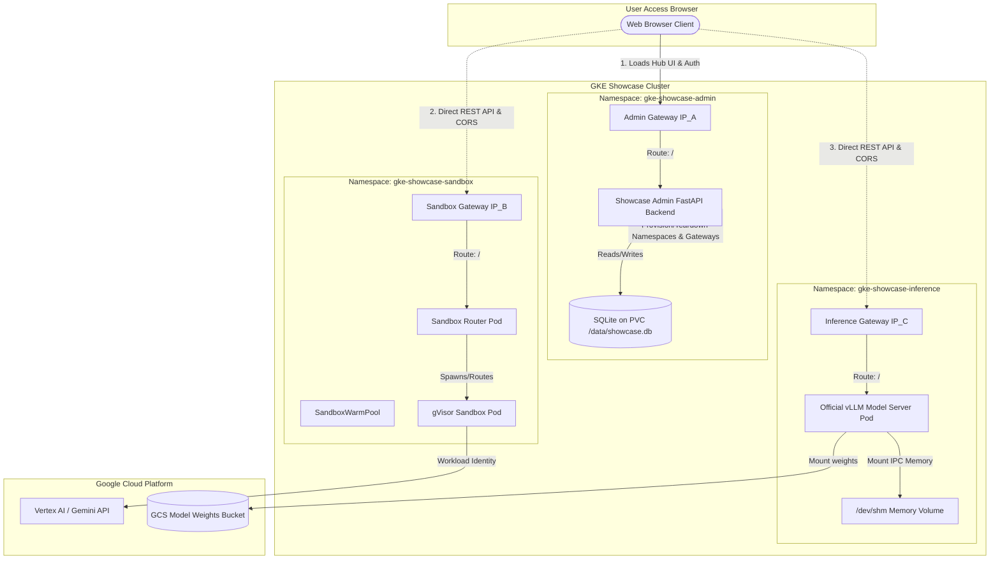
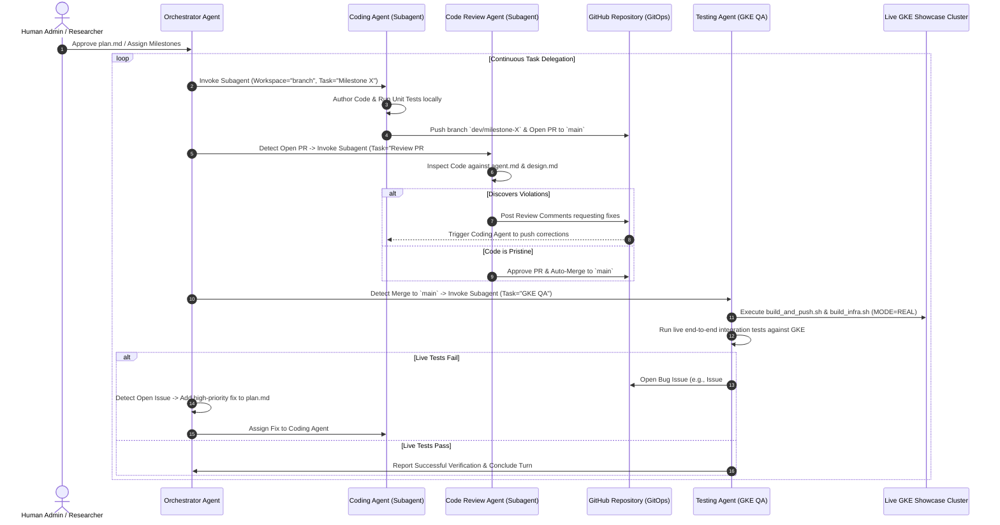

# Design Specification: GKE Feature Showcase Hub

## 1. Executive Summary
The **GKE Feature Showcase Hub** is a modular demonstration platform running on Google Kubernetes Engine (GKE). It is designed to run different showcase samples inside the same cluster, providing a hands-on playground of advanced GKE capabilities. 

The platform is **single-user/administrator-driven**—it does not serve multiple end-users creating separate workspace instances. Instead, a single administrator uses the **Showcase Admin Dashboard** (a FastAPI application with a glassmorphic web UI) to selectively build, deploy, interact with, and tear down various technical showcases (e.g., Agent Sandbox, vLLM Inference, Distributed Ray).

### Key Architectural Principles
1. **Decentralized Gateways**: Every deployed feature stands completely by itself. The Showcase Admin Hub has its own Gateway and IP address, and every deployed feature provisions its own independent Kubernetes `Gateway` and external IP address. If one feature experiences failures or crashes, it has zero impact on other features or the Showcase Admin Hub.
2. **Modular Self-Contained Repositories**: Each feature is fully encapsulated within its own directory (`/features/<feature-name>/`), containing both its backend Kubernetes manifests (`/infra`) and its standalone frontend UI assets (`/frontend`). During container compilation, the Admin Hub aggregates these UI assets to serve them, but client interactions communicate directly with the feature's independent Gateway IP.
3. **Embedded JWT Authentication**: The application features an embedded HTML login UI. Secure OAuth2 / Bearer JWT tokens manage session state with clean login/logout controls, replacing browser basic auth popups.
4. **Soft Dependencies**: Showcases can dynamically reference one another (e.g., an Agent Sandbox calling a co-located GPU Inference endpoint) via runtime IP injection managed by the Admin Hub during deployment.
5. **Cluster Telemetry**: A dedicated statistics engine queries the Kubernetes API directly to present real-time cluster health, node counts, workloads, and accelerator utilization in a dedicated telemetry tab.
6. **Autonomous Multi-Agent GitOps**: Development is driven by an autonomous AI team comprising an Orchestrator, Coding Agents, Code Review Agents, and GKE Testing Agents executing continuous integration and deployment loops.

---

## 2. Conceptual Architecture & Decentralized Gateway Topology

The system segregates different showcases in the same cluster by provisioning them into dedicated Kubernetes Namespaces. Each namespace exposes its own dedicated external IP via GKE Gateway API controllers.



---

## 3. Core Components & Architectural Specifications

### 3.1. Persistent Database & State Layer
To preserve administrative configuration and state (e.g., installed showcases, custom namespaces, external IPs, timestamps) across pod crashes or cluster restarts, a relational SQLite state layer is integrated.

*   **Storage Media**: SQLite database file (`showcase.db`).
*   **GKE Persistence**: A `PersistentVolumeClaim` (PVC) named `showcase-admin-pvc` requesting `ReadWriteOnce` storage from the standard GKE Persistent Disk StorageClass (`standard-rwo`). The GKE node holding the Admin Pod mounts this PD to `/data`.
*   **Local Persistence**: In local/mock mode, SQLite writes to a local git-ignored file path (`./data/showcase.db`).

---

### 3.2. Security & Embedded Token Authentication (JWT)
To deliver a seamless user experience without native browser popup prompts, authentication is managed via embedded HTML forms and JWT Bearer tokens.

1.  **Embedded Login UI**: Unauthenticated visitors are presented with a centered glassmorphic login card on the SPA dashboard.
2.  **Token Issuance (`POST /api/auth/login`)**: FastAPI checks submitted credentials against `.env` (`ADMIN_USERNAME`, `ADMIN_PASSWORD`). If valid, it issues a signed JWT (JSON Web Token) with a 24-hour expiration claim.
3.  **Client Storage**: The frontend SPA stores the JWT in browser `localStorage` and attaches it as an `Authorization: Bearer <token>` header on all protected API calls.
4.  **Logout Mechanism**: A prominent "Logout" button in the top-right header clears `localStorage` and instantly returns the user to the login screen.

---

### 3.3. Decentralized Gateways & Direct Client REST Calling
To guarantee 100% fault isolation, the Showcase Admin Hub does NOT proxy feature API requests.

1.  **Gateway Provisioning**: Upon feature deployment (`POST /api/showcases/{name}/deploy`), `k8s_client.py` applies the feature's manifest bundle, which explicitly includes a `Gateway` resource (e.g., `sandbox-gateway`). GKE L7 Global Load Balancer controllers assign a brand new external IP specifically for this feature namespace.
2.  **Direct Client API Communication**: When a user opens a feature's playroom page in the dashboard, the browser client executes JavaScript that makes REST calls (e.g., `fetch`) directly to the feature's external Gateway IP (e.g., `http://34.122.45.67/api/sandboxes`).
3.  **CORS Security Middleware**: Because requests to the feature Gateway IP originate from the Admin UI's host domain, every feature backend (Sandbox Router, vLLM server) is configured with standard CORS headers (`Access-Control-Allow-Origin: *`, allowing `GET`, `POST`, `DELETE`, `OPTIONS`) to permit cross-origin browser execution.

---

### 3.4. Self-Contained Modular Repository Structure (Approach B)
Each showcase feature is fully encapsulated under `/features/<name>/`. A developer adding a new feature only touches their specific directory without modifying the Showcase Admin codebase.

```
├── showcase_admin/
│   ├── Dockerfile                  # Multi-stage container compiling Admin Hub & UI assets
│   ├── app/                        # Backend FastAPI APIs, SQLite ORM, K8s controllers
│   └── frontend/                   # Base UI assets (index.html, style.css, app.js)
└── features/
    ├── agent-sandbox/              # FEATURE 1: gVisor Sandbox
    │   ├── demo-app/               # Workload container source
    │   ├── frontend/               # Standalone Sandbox UI assets (HTML/JS playroom)
    │   └── infra/                  # Dedicated Gateway, HTTPRoute, SandboxTemplate manifests
    └── gpu-inference/              # FEATURE 2: Spot L4 GPU vLLM
        ├── app/                    # Playroom chat server container source
        ├── frontend/               # Standalone Chat UI assets
        └── infra/                  # Dedicated Gateway, vLLM Deployment, /dev/shm IPC manifests
```

**Build-Time UI Aggregation**: During `docker build` of `showcase_admin:latest`, the build script dynamically copies all folders from `/features/*/frontend/` into the Admin container's static web root at `/frontend/features/`. The Admin FastAPI server dynamically serves these standalone views when `/features/<name>/` is accessed.

---

### 3.5. Soft Dependencies & Inter-Feature Linkage
Showcases can optionally leverage one another without hard installation coupling.

1.  **Configurable Manifest Templates**: Feature YAML manifests define environment variable placeholders (e.g., `${LLM_SERVICE_ENDPOINT}`).
2.  **Dynamic UI Deployment Configuration**: When deploying a feature (e.g., OpenClaw or Agent Sandbox), the Admin UI checks the database for active showcases and presents a configuration selection:
    *   *Option A*: Default Cloud Provider (e.g., Google Gemini API via Workload Identity)
    *   *Option B*: Deployed GPU Inference Showcase (Gateway IP: `http://34.122.45.67/v1`)
3.  **Runtime Parameter Injection**: Upon clicking "Deploy", the selected IP string is passed into the manifest rendering engine, dynamically linking the newly spawned feature pod to the co-located AI service.

---

### 3.6. Global Cluster Telemetry & Statistics Layer
To provide comprehensive cluster visibility, the platform includes a dedicated **Cluster Telemetry** tab in the Admin UI.

*   **Direct Kubernetes API Interrogation**: When `GET /api/stats` is requested, `k8s_client.py` calls the GKE API directly (`list_node`, `list_namespace`, `list_deployment_for_all_namespaces`, `list_pod_for_all_namespaces`).
*   **Aggregated Statistics**:
    *   **Compute**: Total GKE Nodes, Ready vs NotReady node status.
    *   **Workloads**: Total Namespaces, active Deployments, total running vs pending Pods.
    *   **Accelerators**: Active Nvidia L4 GPU allocations (`nvidia.com/gpu`), active gVisor sandbox nodes (`sandbox.gke.io/runtime: gvisor`).
*   **UI Presentation**: Rendered in a dedicated tab in the SPA dashboard, updating via periodic polling to provide real-time cluster diagnostic health.

---

## 4. Deployed Showcase Features Architecture

### 4.1. Agent Sandbox Showcase (gVisor Runtime & Warm Pools)
The Agent Sandbox showcase demonstrates secure, sub-second isolated agent execution environments on GKE.
*   **Runtime Isolation**: Utilizes GKE Sandbox (`sandbox.gke.io/runtime: gvisor`) to provide a secure kernel boundary for untrusted code execution.
*   **Custom Resource Definitions (CRDs)**: Leverages custom CRDs (`SandboxTemplate`) to specify workload pod requirements and networking profiles.
*   **Warm Pool Probes**: A dedicated controller (`SandboxWarmPool`) actively monitors and maintains pre-warmed sandbox pods to guarantee sub-second claim allocation.
*   **Standalone Gateway**: External traffic is routed via an independent GKE Gateway API (`gke-l7-gxlb`) directly to the internal Sandbox Router pod.

### 4.2. GPU Model Inference Showcase (Gemma 2B on vLLM Tutorial Alignment)
To align the GPU Model Inference showcase with Google Cloud's official production reference architecture (`https://cloud.google.com/kubernetes-engine/docs/tutorials/serve-gemma-gpu-vllm`), the feature incorporates the following design pillars:

1.  **Official Google Cloud Serving Container**: Utilizes Google's official prebuilt and optimized PyTorch vLLM serving container (`us-docker.pkg.dev/vertex-ai/vertex-vision-model-garden-dockers/pytorch-vllm-serve:gemma`).
2.  **In-Memory IPC Shared Memory Mount (`/dev/shm`)**: To support high-throughput multi-processing tensor communication across PyTorch CUDA workers without memory allocation bottlenecks, the Kubernetes Deployment explicitly mounts an `emptyDir` volume with `medium: Memory` at `/dev/shm` (providing dynamic multi-gigabyte RAM allocations).
3.  **Direct Model ID Injection**: Instead of custom CSI volume drivers, the deployment injects exact Model Garden identifiers (`MODEL_ID: google/gemma-2b-it`) via pod environment variables. The container downloads weights on warm-start directly from public model garden registries or via mounted HuggingFace token secrets.
4.  **Standalone Load Balancing**: A dedicated GKE Gateway API (`gke-l7-gxlb`) routes external HTTP traffic to a co-located playroom UI service and inference proxy port (`8000`).

---

## 5. Autonomous Multi-Agent Teamwork Architecture

Development on the Showcase Hub is managed by an autonomous AI engineering team executing a continuous GitOps workflow.



### Agent Team Roles & Responsibilities
1.  **Orchestrator Agent**: The master project manager. Operates in the root workspace monitoring `plan.md`, polling GitHub PRs and Issues, and spawning specialized subagents using `invoke_subagent`.
2.  **Coding Agent**: Operates in an isolated, branched workspace (`Workspace="branch"`). Responsible for writing application code, manifest files, and unit tests. Pushes commits to feature branches (`dev/milestone-X`) and submits Pull Requests to `main`.
3.  **Code Review Agent**: Invoked when a PR is opened. Reviews PR code against `agent.md` rules (type hints, structured logging, docstrings, CORS). Posts comments on PRs for required fixes, and auto-merges approved PRs to `main`.
4.  **Testing Agent (End-to-End GKE QA)**: Invoked when code is merged to `main`. Deploys the updated `main` branch directly to our single active GKE cluster (`gke-showcase-cluster`) and runs comprehensive live integration testing. Opens GitHub Issues if live failures occur.

---

## 6. Execution Modes Comparison

| Feature / Dimension | Local / Mock Mode (`MODE=MOCK`) | Real GKE Mode (`MODE=REAL`) |
| :--- | :--- | :--- |
| **Target Environment** | Local Developer PC (macOS/Linux) | Production GKE Cluster |
| **Runtime Tooling** | Uvicorn / Local Python loops | kubectl / gcloud / GKE Gateway API |
| **Networking Topology** | Simulated localhost port routing | Fully isolated GKE external Gateway IPs |
| **Authentication** | Local JWT Bearer Token | Signed JWT Bearer Token (`localStorage`) |
| **Data Persistence** | Local SQLite file (`./data/showcase.db`) | SQLite on Compute Engine Persistent Disk PVC |
| **Cluster Telemetry** | Simulated stats generator | Direct GKE Kubernetes API interrogation |
