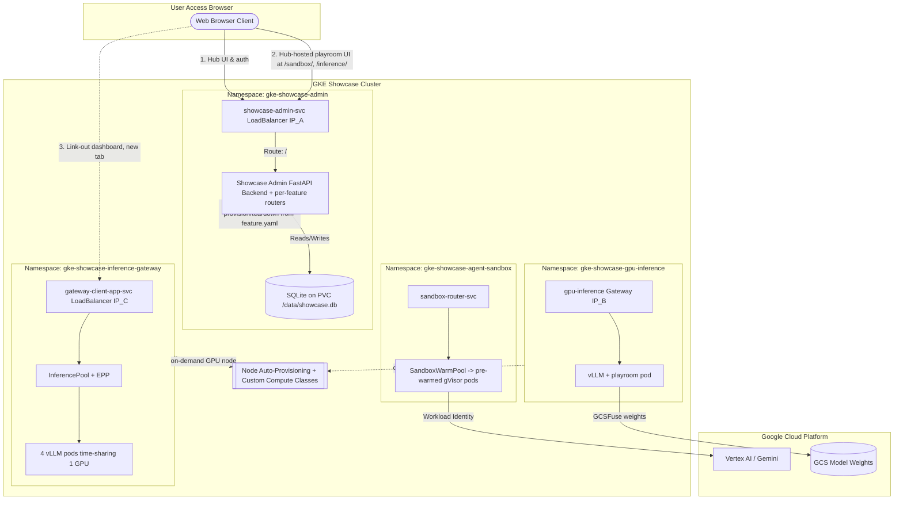

# Design Specification: GKE Feature Showcase Hub

## 1. Executive Summary
The **GKE Feature Showcase Hub** is a modular demonstration platform running on Google Kubernetes Engine (GKE). It runs many independent showcase samples inside one cluster, providing a hands-on playground of advanced GKE capabilities.

The platform is **single-user/administrator-driven** — a single administrator uses the **Showcase Admin Dashboard** (a FastAPI app with a glassmorphic web UI) to selectively build, deploy, interact with, and tear down technical showcases (e.g. Agent Sandbox, GPU vLLM Inference, GKE Inference Gateway).

The defining property is that it is **manifest-driven and plugin-based**: a feature is a directory under `features/<name>/` containing a `feature.yaml` descriptor. The Hub discovers features by scanning `features/*/feature.yaml` and derives the dashboard card, build targets, deploy/teardown, UI, and data-plane API from the descriptor — so **adding a feature requires zero edits to Hub core code**. The authoring contract for this is `feature.md`.

### Key Architectural Principles
1. **Manifest-Driven Feature Platform**: Features are plugins discovered from their `feature.yaml`. The Hub loader (`showcase_admin/app/features.py`) builds all runtime maps (showcases, deployments, URLs, routers, frontends, template defaults) from descriptors. No hardcoded per-feature maps in Hub core.
2. **Two Feature Flavors**: A feature can be **local** (lives in this repo, e.g. `agent-sandbox`, `gpu-inference`) or **external** (its own git repo, mounted as a **submodule**, e.g. `inference-gateway`). Both expose an identical `feature.yaml`; the flavor only changes the authoring/update workflow.
3. **Decentralized Gateways**: Every deployed feature stands alone in its own namespace with its own `Gateway` and external IP. A feature crash has zero impact on other features or the Admin Hub. The Admin Hub itself is exposed via a `LoadBalancer` Service.
4. **Two UI Integration Models**: *Hub-hosted playroom* (the Hub mirrors the feature's static UI and serves it at `/<slug>/`, fronting its API via a per-feature router) or *link-out* (the feature serves its own UI+API at its own LoadBalancer; the Hub links straight to it). See §4.
5. **Embedded JWT Authentication**: An embedded HTML login UI issues signed Bearer JWTs (no browser basic-auth popups).
6. **Namespace-Portability**: The Hub deploys each feature into its own namespace, so manifests must be namespace-portable (`${NAMESPACE}`, no hardcoded `default`). The Hub auto-rewrites `metadata.namespace` and RBAC `ServiceAccount` subjects; authors template the rest.
7. **On-Demand Specialized Compute**: No GPU/gVisor pools are pre-created. GPU nodes are provisioned on demand by per-feature **Custom Compute Classes** + **Node Auto-Provisioning** with Spot→on-demand and accelerator fallback; gVisor runs on a zero-cost autoscaling pool.
8. **Cluster Telemetry**: A statistics engine queries the Kubernetes API directly for live nodes, namespaces, workloads, and accelerator utilization.

---

## 2. Conceptual Architecture & Decentralized Topology

Each showcase is segregated into its own namespace with its own external entry point. The Admin Hub is the control plane: it reads feature descriptors and drives the Kubernetes API to provision/teardown namespaces and resources.

---

## 3. The Manifest-Driven Feature Platform

This is the core of the Hub. The authoring contract is `feature.md`; this section is the implementation view.

### 3.1 Descriptor discovery (`feature.yaml` → `features.py`)
At startup `showcase_admin/app/features.py` scans `features/*/feature.yaml` and exposes loader functions consumed across the app, e.g.:
- `available_showcases()` → dashboard cards (`main.py`).
- `deployment_map()` / `url_map()` → readiness polling + reach-out links (`k8s_client.py`).
- `playroom_routes()` + `aggregate_frontends()` → mirror each hub-hosted feature's static UI into the served root, served at `/<playroom_slug>/`.
- `load_routers()` → import each feature's `hub_router` and mount it at `/api/features/<name>`.
- `template_defaults()` / `infra_dirs()` / `entrypoint_service()` → deploy-time variable resolution, manifest dirs, and link-out address.

Because every map is derived from descriptors, **no Hub-core file is edited to add a feature**.

### 3.2 Local vs external features
- **Local**: lives in this repo under `features/<name>/`, tracked by the Hub's git history.
- **External**: its own repo, added as a **git submodule** at `features/<name>/`, tracked by a `.gitmodules` entry + pinned commit. `build_infra.sh` and `scripts/build_and_push.sh` auto-run `git submodule update --init --recursive`. `inference-gateway` (from `ragoler/inference_gateway`) is external and also runs fully standalone via its own scripts.

### 3.3 Build pipeline
`scripts/build_and_push.sh` is descriptor-driven: it reads each feature's `build:` entries, compiles/pushes those images (plus the Admin image, which bundles `features/` and the aggregated UIs), and then rolls the affected Deployments — fetching cluster credentials first so it works from a dedicated build machine.

### 3.4 Cluster-scoped prerequisites (`cluster_dir`)
Resources that exist once per cluster (CRD bundles, etc.) are declared via `paths.cluster_dir` and applied at **bootstrap** (`build_infra.sh`), not per deploy. The loop supports plain YAML (`kubectl apply -f` with variable expansion) **and** a `kustomization.yaml` (`kubectl apply -k`) — the latter is how `inference-gateway` installs the upstream gateway-api-inference-extension CRDs (pinned version). A `ComputeClass` placed in a per-namespace `infra_dir` is still routed to the cluster-scoped API automatically.

### 3.5 Manifest application
On deploy, `k8s_client.apply_yaml_manifests` creates the namespace, expands `${VAR}` placeholders, and applies each manifest. It dispatches built-in kinds via typed APIs (Deployment, Service, ConfigMap, Secret, ServiceAccount, RBAC) and arbitrary CRDs generically (correct pluralization; cluster- vs namespace-scoped). It rewrites each doc's `metadata.namespace` and the `ServiceAccount` subjects of `RoleBinding`/`ClusterRoleBinding` to the deploy namespace, so features authored for a standalone `default` namespace still bind correctly under the Hub.

---

## 4. Feature Integration Models

| | **Hub-hosted playroom** | **Link-out** |
|---|---|---|
| Declares | `paths.frontend_dir` + `paths.playroom_slug` (+ usually `hub_router`) | `entrypoint_service: <LoadBalancer Service>` |
| UI served by | the Hub (mirrors static UI at `/<slug>/`) | the feature, at its own external LB |
| Data-plane API | the feature's `hub_router` mounted at `/api/features/<name>` (behind the Hub JWT) | the feature's own app at its own IP (CORS) |
| Dashboard link | internal Hub path, same tab | the Service's external IP, **new tab** (↗) |
| Examples | `agent-sandbox`, `gpu-inference` | `inference-gateway` |

**Per-feature data-plane router.** Each hub-hosted feature owns its backend API as a FastAPI `APIRouter` (its own "proxy"), mounted under `/api/features/<name>` with the admin JWT dependency applied — so a feature's API is added/removed with the feature and can never collide with another's, with zero edits to Hub core.

**Link-out resolution.** For a link-out feature the Hub resolves the `entrypoint_service` external IP once its LoadBalancer is assigned, and re-resolves on later status polls (so a slow LB never leaves a dead "Feature dashboard" link).

---

## 5. Core Components

### 5.1 Persistent state
SQLite (`showcase.db`) persists installed showcases, namespaces, reach-out URLs, status, and timestamps. In GKE it lives on a `ReadWriteOnce` PVC (`showcase-admin-pvc`, `standard-rwo`) mounted at `/data`; locally it writes `./data/showcase.db`.

### 5.2 Embedded JWT authentication
`POST /api/auth/login` validates credentials against `.env` (`ADMIN_USERNAME`/`ADMIN_PASSWORD`) and issues a signed JWT (HS256, 24h). The SPA stores it in `localStorage` and sends `Authorization: Bearer <token>` on protected calls; logout clears it. (The Hub API uses Bearer JWT — not HTTP basic.)

### 5.3 Decentralized gateways & direct client calls
The Hub does not proxy feature data-plane traffic. Hub-hosted playroom JS calls the feature's router under `/api/features/<name>/...` (the Hub fronts it); link-out apps are called directly at their own Gateway/LB IP, which is why feature backends set permissive CORS.

### 5.4 Soft dependencies (inter-feature linkage)
Features can reference one another at deploy time. The Admin Hub injects a co-deployed model endpoint into manifests/headers (e.g. the Agent Sandbox can route a "quote" to the `gpu-inference` vLLM). Because a sandbox has only public DNS, the Hub resolves the target Service's **ClusterIP** and passes it to the sandbox rather than a cluster DNS name.

### 5.5 Cluster telemetry
`GET /api/stats` queries the K8s API directly (`list_node`, `list_namespace`, pods/deployments) and aggregates node readiness, namespaces/workloads, and accelerators (NVIDIA L4 / RTX PRO 6000 GPUs, gVisor nodes).

---

## 6. Lifecycle & Status State Machine

A showcase moves through: `DORMANT → DEPLOYING → PROVISIONING → ACTIVE`, with `ACTIVE ↔ REPROVISIONING` for transient capacity loss, and `→ TERMINATING → DORMANT` on teardown (`ERROR` on failure). Transitions are validated in `database.py` and driven by `check_and_update_showcase_status` (polled on every `GET /api/showcases`):

- **PROVISIONING vs ACTIVE** is gated on *real readiness*. Workloads define readiness probes (e.g. vLLM `/health`) so the Deployment is only `ready` once it can actually serve — the card honestly shows PROVISIONING during GPU node provisioning + model load, not the instant the pod starts.
- **REPROVISIONING** is the bidirectional downgrade: if an `ACTIVE` feature loses its replicas (e.g. a **Spot GPU reclaim**), the Hub flips it to REPROVISIONING; the workload self-heals via the Compute Class and returns to ACTIVE. Data-plane calls during this window return a clear "re-provisioning" message instead of a raw error.
- **reach_out_url** is resolved when a feature becomes ACTIVE and re-resolved while ACTIVE if still empty (covers a LoadBalancer that binds its IP after readiness).

---

## 7. GPU Provisioning: Node Auto-Provisioning + Custom Compute Classes

No GPU node pools are pre-created. `build_infra.sh` enables **Node Auto-Provisioning** (NAP) with accelerator limits. Each GPU feature ships a **Custom Compute Class** (`cloud.google.com/v1 ComputeClass`) with an ordered `priorities` fallback chain, so a node provisions even under Spot stockout:
- `gpu-inference` (`gpu-inference-flex`): G2 Spot L4 → G4 Spot RTX PRO 6000 → G2 on-demand L4 → G4 on-demand. The vLLM Deployment requires it via `nodeSelector: cloud.google.com/compute-class`.
- `inference-gateway`: prefers G4 (RTX PRO 6000) then L4, with **GPU time-sharing** so all 4 model-server replicas co-schedule on a single physical GPU.

`activeMigration` keeps workloads on the highest-priority tier that has capacity. This is what lets heavy GPU demos deploy reliably on demand.

---

## 8. Deployed Showcase Features

### 8.1 Agent Sandbox (gVisor) — hub-hosted playroom
Secure, sub-second isolated execution for untrusted/agent code via GKE Agent Sandbox (`sandbox.gke.io/runtime: gvisor`). Uses the official `k8s-agent-sandbox` client and CRDs (`SandboxTemplate`, `SandboxWarmPool`, `SandboxClaim`, `Sandbox`): a `SandboxWarmPool` keeps pre-warmed pods for instant claims; claims are created/terminated through the Hub's `hub_router`, routed via `sandbox-router-svc`. Demonstrates Workload Identity (Vertex AI "quote") and optional cross-feature routing to the `gpu-inference` vLLM. gVisor pods run on a zero-cost autoscaling node pool.

### 8.2 GPU Model Inference (vLLM) — hub-hosted playroom
Serves an LLM on a GPU provisioned on demand via the `gpu-inference-flex` Compute Class (no fixed pool). Uses Google's official vLLM serving container (`pytorch-vllm-serve:latest`) loading `codegemma-7b-it` from a public GCS Model Garden bucket (GCSFuse), with a `/dev/shm` memory volume for IPC. A `/health` readiness probe gates the card's PROVISIONING→ACTIVE transition and Spot-reclaim REPROVISIONING. A co-located playroom container serves the chat client; the Hub's `hub_router` proxies chat to it.

### 8.3 GKE Inference Gateway (llm-d) — external submodule, link-out
The state-of-the-art AI-aware L7 routing pattern. Deploys an `InferencePool` + Endpoint Picker (EPP) with **prefix-cache-aware routing** over **4 vLLM replicas time-sharing one GPU**, behind an internal `gke-l7-rilb` Gateway, plus a client app (external LoadBalancer) that runs the headline **load-test comparison** (EPP routing vs cache-blind round-robin: TTFT, throughput, cache-hit rate). It is **link-out** (`entrypoint_service: gateway-client-app-svc`) and **namespace-portable** (`${NAMESPACE}` everywhere, `POD_NAMESPACE` via the downward API), and declares the gateway-api-inference-extension CRDs as a `cluster_dir` kustomize prereq. It also runs fully standalone in the `default` namespace from its own repo.

---

## 9. Execution Modes Comparison

| Dimension | Local / Mock (`MODE=MOCK`) | Real GKE (`MODE=REAL`) |
| :--- | :--- | :--- |
| **Environment** | Local dev PC | GKE cluster |
| **Runtime** | Uvicorn / simulated state | kubectl / gcloud / GKE Gateway + Inference APIs |
| **Networking** | Simulated localhost routing | Isolated per-feature external Gateway/LB IPs |
| **Auth** | JWT Bearer | Signed JWT Bearer (`localStorage`) |
| **Persistence** | Local SQLite file | SQLite on PD-backed PVC |
| **GPU** | Simulated | NAP + Custom Compute Class (Spot→on-demand fallback) |
| **Telemetry** | Simulated stats | Direct K8s API interrogation |
