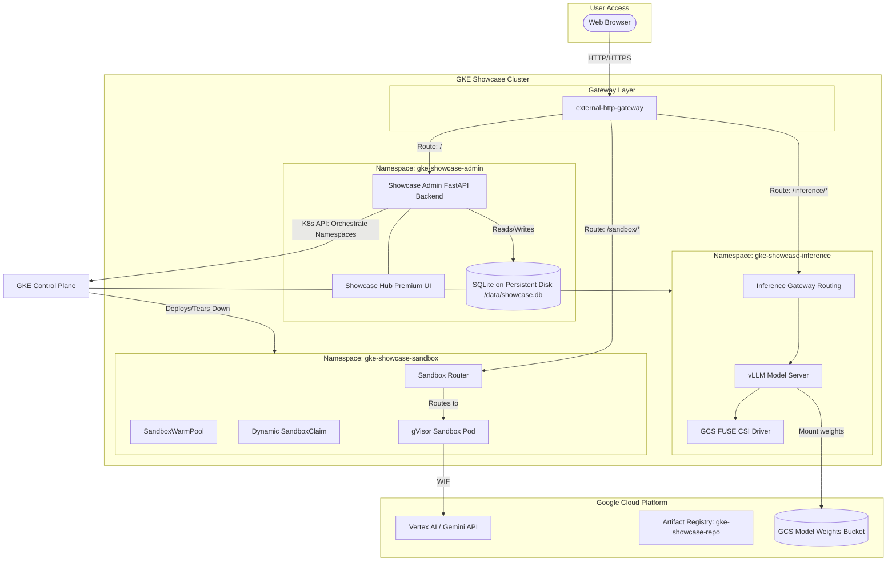

# Design Specification: GKE Feature Showcase Hub

## 1. Executive Summary
The **GKE Feature Showcase Hub** is a modular demonstration platform running on Google Kubernetes Engine (GKE). It is designed to run different showcase samples inside the same cluster, providing a hands-on playground of advanced GKE capabilities. 

The platform is **single-user/administrator-driven**—it does not serve multiple end-users creating separate workspace instances. Instead, a single administrator uses the **Showcase Admin Dashboard** (a FastAPI application with a high-fidelity web UI) to selectively build, deploy, interact with, and tear down various technical showcases (e.g., Agent Sandbox, vLLM Inference, Distributed Ray).

To support rapid local developer loops, the architecture includes a first-class **Local/Mock mode** running offline via Docker Compose or local python processes.

---

## 2. Conceptual Architecture & Multi-Sample Topology

The system segregates different showcases in the same cluster by provisioning them into dedicated Kubernetes Namespaces. A single shared gateway handles external traffic routing.



---

## 3. Core Components & Architectural Enhancements

### 3.1. Persistent Database & State Layer
To preserve administrative configuration and state (e.g., which showcases are installed, custom settings, user preferences, audit logs) across pod crashes or cluster restarts, a state layer is integrated.

*   **Storage Media**: SQLite database file (`showcase.db`). SQLite provides a zero-overhead relational schema that fits the single-user, low-throughput requirements perfectly.
*   **GKE Persistence**: 
    *   A `PersistentVolumeClaim` (PVC) named `showcase-admin-pvc` requesting `ReadWriteOnce` storage from the standard GKE Persistent Disk StorageClass (`standard-rwo`).
    *   The GKE node holding the Admin Pod mounts this PD to `/data`.
    *   FastAPI initializes SQLite at `/data/showcase.db`.
    *   If the pod crashes or restarts, GKE remounts the same PD to the replacement pod, guaranteeing full database preservation.
*   **Local Persistence**: In local/mock mode, SQLite writes to a local file path (`./data/showcase.db`), which is git-ignored.

---

### 3.2. Security & Authentication (Future Lock)
To allow the dashboard to be secured in sensitive environments, a simple Basic Authentication guard is architected.

*   **Credentials**: Configuration is loaded directly from the `.env` file:
    ```env
    ADMIN_AUTHENTICATION_ENABLED=TRUE
    ADMIN_USERNAME=admin
    ADMIN_PASSWORD=your-secure-password-12345
    ```
*   **FastAPI Middleware**:
    *   An optional security dependency (`fastapi.security.HTTPBasic`) checks incoming requests.
    *   If `ADMIN_AUTHENTICATION_ENABLED` is `TRUE`, all HTML routing and API endpoints require the matching username and password.
    *   Supports password hashing (e.g., using `passlib` or `bcrypt`) to avoid plain-text memory matching.

---

### 3.3. Test Framework & Automated Testing (`/tests`)
Quality control is managed via an extensive automated testing suite running under `pytest`.

*   **Directory Structure**:
    ```
    /tests
      /unit
        test_auth.py          # Verifies Basic Auth logic and security middleware
        test_config.py        # Verifies environment loader configurations
        test_db.py            # Verifies SQLite migrations and ORM operations
      /integration
        test_api_mock.py      # Verifies FastAPI endpoints using mocked K8s client
        test_k8s_mock.py      # Verifies dynamic manifest rendering and mock deployments
      conftest.py             # Standard Pytest fixtures, FastAPI TestClient initialization
    ```
*   **Mocking Philosophy**: Tests use unit mock bindings (`unittest.mock`) to intercept all calls to the Kubernetes API, ensuring the test suite runs instantly in local environments without a GKE connection.

---

### 3.4. Showcase Modules Specification (`/features`)
Each showcase module is fully self-contained under `/features/<name>`. The Showcase Admin Dashboard enables the user to:
1.  **Input a Custom Namespace**: Prior to deploying, the administrator can type a custom Kubernetes Namespace on the UI. The dynamic deploy endpoint (`POST /api/showcases/{name}/deploy`) accepts this namespace, creates it dynamically, and applies the feature manifests to it. If left blank, it defaults to `gke-showcase-{name}`.
2.  **Delete / Tear Down**: The administrator can select "Tear Down Showcase" from the dashboard. This executes a clean, cascading deletion of the target namespace (`DELETE /api/showcases/{name}/teardown`), immediately freeing up all cluster compute and GKE resources.
3.  **Access & Interaction Playrooms**: Each active card displays a dedicated "Reach Out URL" (the external HTTP Gateway routing path for that namespace) and opens an interactive "Playroom Console" directly within the Showcase Hub dashboard to let the user test the running module instantly.

#### Feature 1: GKE Agent Sandbox
*   **Goal**: Demonstrate secure runtimes for isolated, dynamic agent workloads (untrusted code execution).
*   **GKE Features Illustrated**: **GKE Agent Sandbox** (gVisor integration), `SandboxTemplate` / `SandboxClaims` CRDs, `SandboxWarmPool`, and inter-cluster service networking.
*   **Interaction Playroom**: An embedded workspace console where users can:
    - Create dynamic sandboxes on-demand (under 1 second).
    - Message individual sandboxes.
    - Trigger sleep/wake cycles.
*   **Flexible Model Provider Integration (Dual Routing)**:
    - When provisioning a sandbox, the user can select the LLM provider:
        1.  **Cloud Vertex AI (Gemini)**: Sandbox pods authenticate via GKE Workload Identity Federation (using service account `sandbox-ai-sa` mapped to GCP `roles/aiplatform.user`).
        2.  **Local Self-Hosted Inference (vLLM)**: Sandbox pods are dynamically configured to call the custom **vLLM Inference Showcase** running in the same cluster. The sandbox environment variables are set to route API requests locally:
            *   `OPENAI_API_BASE=http://vllm-service.<vllm-namespace>.svc.cluster.local:8000/v1`
            *   `MODEL_NAME=gemma-2b-it` (or any deployed model).
            *   This completely avoids outbound internet traffic, showcasing safe, low-latency, local model inference within GKE's secure cluster boundary.

#### Feature 2: vLLM GPU Model Inference
*   **Goal**: Deploy a self-hosted, optimized open-source LLM (e.g., Gemma 2B) behind a shared inference gateway.
*   **GKE Features Illustrated**: Dynamic GPU node pool provisioning, **Spot NVIDIA L4 GPU Node Pools**, **GCSFuse CSI Driver** (mounting model weights directly from a GCS bucket), and GKE Gateway routing.
*   **Interaction Playroom**: An embedded chat playground client targeting the OpenAI-compatible API served by vLLM, showing direct response token streaming, model stats, and inference latency.
*   **Integration Output**: Exposes a stable cluster-internal service endpoint (`http://vllm-service.<vllm-namespace>.svc.cluster.local:8000`) which other showcases (like the Agent Sandbox) can leverage for local AI reasoning.

---

## 4. Execution Modes

To support both high-speed local coding and real cluster deployments, the system operates in two distinct modes:

| Feature / Dimension | Local / Mock Mode (`MODE=MOCK`) | Real GKE Mode (`MODE=REAL`) |
| :--- | :--- | :--- |
| **Target Environment** | Local Developer PC (macOS/Linux) | Production GKE Cluster |
| **Runtime Tooling** | Uvicorn / Docker Compose | kubectl / gcloud / GKE Gateway |
| **Orchestration Client** | Simulated Python state loops | Asynchronous `kubernetes_asyncio` API |
| **Data Persistence** | Local SQLite file (`./data/showcase.db`) | SQLite on Compute Engine Persistent Disk PVC |
| **External Gateways** | Mocked localhost ports | GKE standard Gateway API |

---

## 5. Infrastructure Setup Script (`build_infra.sh`)

This script handles the base bootstrap sequence of the GKE cluster, provisioning only shared baseline resources to minimize upfront cloud costs:

1.  **Validation**: Reads `.env` parameters and ensures `gcloud` context is set.
2.  **Shared Base Provisioning**:
    *   Creates the GKE Cluster with standard default node pool (for Admin Pod) and Workload Identity enabled.
    *   Enables the GKE Gateway API and deploys the central `external-http-gateway`.
    *   Configures direct IAM principal bindings for Vertex AI WIF.
    *   *Note*: Specialized node pools (gVisor and GPU Spot L4 pools) are **omitted** here. They are created dynamically by the Showcase Admin app on feature deployment, and deleted on teardown to optimize cost.
3.  **Admin Pod Deployment**:
    *   Deploys the PersistentVolumeClaim (`showcase-admin-pvc`).
    *   Deploys the Showcase Admin Dashboard pod in namespace `gke-showcase-admin`, mounting the persistent disk to `/data`.
    *   Deploys the matching GKE LoadBalancer Service or Gateway route pointing to the Admin pod.
